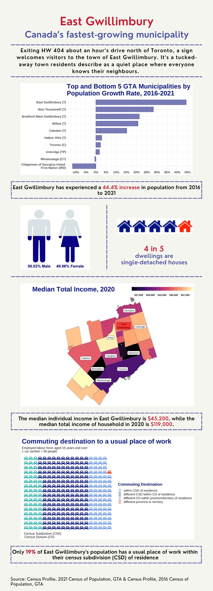

This project visualizes key demographic and socio-economic data for East Gwillimbury, Canada’s fastest-growing municipality from 2016 to 2021. The infographic was developed using R, incorporating data from the 2021 Census of Population for the Greater Toronto Area (GTA). The visualizations highlight population growth, gender distribution, dwelling types, income levels, and commuting patterns in East Gwillimbury.

Check out the infographic below to see the data come to life. If you’re interested in the code and data-cleaning steps behind these visualizations, you can find them [here](East_Gwillimbury_Population.html). Note that the file is quite big, so you might need to download it to view it properly.

Feel free to reach out if you have any questions or feedback :)

